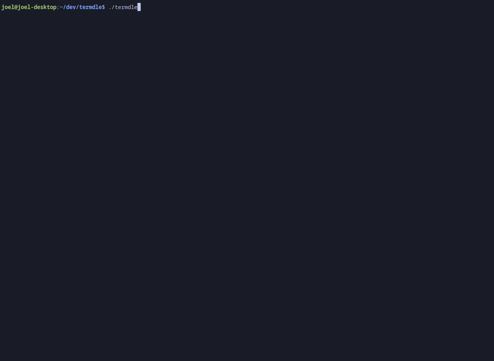

# Tuidle

Play Wordle in your terminal! A TUI version of the popular game Wordle built using Go and the [charmcli](https://github.com/charmbracelet) tools, namely [bubbletea](https://github.com/charmbracelet/bubbletea).

Warning: The code is probably not great, this is my first Go project :)

## Demo



## Build From Source

### Requirements

Go 1.21 or later

### Instructions

1. Clone repository

```
git clone https://github.com/Givo29/Tuidle.git
```

2. Rename example-words.txt to words or supply own words file

```
mv example-words.txt words.txt
```

3. Build

```
go build
```

## Todos

- [x] Use JSON to record games and scores
- [ ] Save guess on every guess so user can't cheat
- [ ] Add an option to share your game
- [ ] Add an option to export your JSON file
- [x] Display streak after game end
- [ ] Add stats page?
- [ ] If game is already complete today, show stats instead of starting a new game
- [ ] Show keyboard feedback like in the real game?
